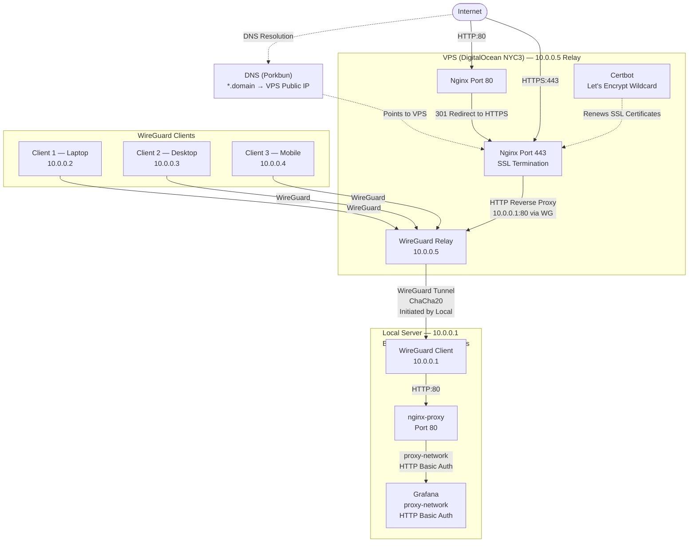
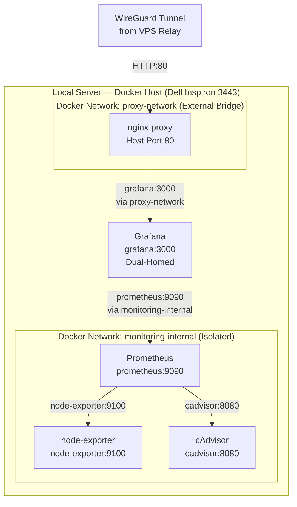

# Architecture

## Overview

This document describes the overall system architecture of the `server-dell` homelab infrastructure.

The environment runs on a physical Dell Inspiron 3443 server located within a residential network behind Carrier-Grade NAT (CGNAT) and a consumer router with no port-forwarding capabilities. To provide secure, reliable public and remote access without exposing internal network interfaces, the infrastructure implements a split architecture:

1. **Ingress & VPN Relay:** A cloud VPS (DigitalOcean NYC3, `10.0.0.5`) acts as the single public entry point, running Nginx for reverse proxying, Certbot for SSL certificate automation via DNS challenge, and a WireGuard relay.
2. **Encrypted Tunnel:** A permanent WireGuard tunnel (ChaCha20-Poly1305) connects the Local Server (`10.0.0.1`) to the VPS (`10.0.0.5`). The tunnel is initiated outbound by the Local Server (`PersistentKeepalive = 25`), traversing the home NAT seamlessly.
3. **SSL Termination Strategy:** SSL terminates entirely at the VPS Nginx instance. Traffic traveling through the WireGuard tunnel from VPS to the Local Server is proxied via HTTP (`10.0.0.1:80`), relying on WireGuard's native ChaCha20-Poly1305 encryption and avoiding double TLS overhead.
4. **Local Container Segmentation:** On the Local Server, applications are orchestrated as separate Docker Compose stacks. An external Docker network (`proxy-network`) connects front-facing endpoints (such as Grafana protected by HTTP Basic Auth) to the local reverse proxy (`nginx-proxy`), while backend monitoring infrastructure remains isolated on a dedicated bridge network (`monitoring-internal`).
5. **Remote Client Access:** Authorized remote devices (laptop, desktop, mobile) connect to the WireGuard network through the VPS relay, allowing secure administrative access to internal services.

---

## Diagram 1 — General Architecture

This diagram illustrates the end-to-end traffic flow from the internet and remote clients through the VPS relay down to the Local Server and its internal services.

### Key Architectural Principles

- **VPS is strictly a relay:** The VPS acts solely as a reverse proxy and WireGuard relay. It hosts no application state, persistent data, or backend databases.
- **No direct internet access to Local Server:** The Local Server has no public IP address and no open inbound ports on the residential router. It is completely unreachable directly from the public internet.
- **Permanent tunnel:** The WireGuard tunnel between VPS (`10.0.0.5`) and Local Server (`10.0.0.1`) is kept permanently open via outbound keepalive handshakes initiated by the Local Server.
- **SSL termination at the VPS:** Public HTTPS connections terminate at the VPS Nginx instance. The inner leg between VPS and Local Server is transported over plain HTTP inside the encrypted WireGuard tunnel.
- **Client routing:** WireGuard clients (Laptop `10.0.0.2`, Desktop `10.0.0.3`, Mobile `10.0.0.4`) route through the VPS WireGuard relay to access internal homelab services.
- **Local reverse proxy & authentication:** The Local Server's `nginx-proxy` receives HTTP requests on port 80 and enforces HTTP Basic Auth before proxying requests to Grafana over `proxy-network`.

---

## Diagram 2 — Docker Networks

This diagram illustrates the Docker network topology and segmentation implemented on the Local Server (`server-dell`).

### Key Network Isolation Principles

- **Dual-homed gateway container:** `Grafana` is the **only container** attached to both `proxy-network` and `monitoring-internal`. This allows `nginx-proxy` to route external traffic to Grafana while enabling Grafana to query metrics from Prometheus.
- **Isolated backend services:** `Prometheus`, `node-exporter`, and `cAdvisor` belong strictly to `monitoring-internal`. They have no interface on `proxy-network` and publish no ports to the host interface, preventing direct access from the reverse proxy, the local network, or the public internet.
- **Embedded Docker DNS:** Container communication uses internal Docker DNS resolution (`grafana:3000`, `prometheus:9090`, `node-exporter:9100`, `cadvisor:8080`) rather than exposed host ports or host IP addresses.
- **Controlled exposure:** Only `nginx-proxy` publishes ports to the host interface (`80` and `443`), serving as the single gated point of entry into containerized services on the Local Server.

